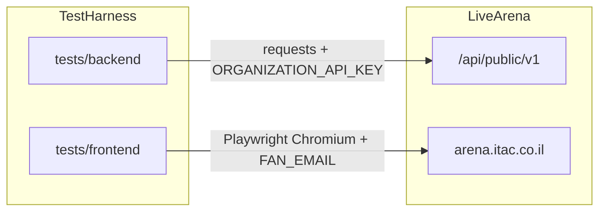

# Software Test Plan — ITAC Arena

| Field | Value |
| --- | --- |
| Document identifier | STP-ARENA-001 |
| Version | 1.0 |
| Date | 2026-09-18 |
| System under test | ITAC Arena live tenant (`https://arena.itac.co.il`) |
| API base | `https://arena.itac.co.il/api/public/v1` |
| Test harness | This repository (pytest automation; not the product source) |
| Tools | pytest 8.4.2, Playwright 1.63.0, pytest-playwright 0.9.0, pytest-check 2.6.2, requests 2.34.2, pydantic-settings 2.11.0 |

This plan documents the **existing automated regression suite**. It does not add coverage beyond the nine pytest functions currently in `tests/`.

---

## 1. Introduction

### 1.1 Purpose

Define how the current harness validates Arena: what is tested, how tests run, what constitutes pass/fail, and which environmental constraints apply. Product requirements are inferred from the live UI, public API clients, and the implemented tests. There is no separate SRS in this repository.

### 1.2 Scope

In scope:

- Organizer event create / read / update / publish via the public API
- Admin events UI: create draft, publish, rename, optional delete
- Fan events catalog: draft stays hidden until published
- My Orders: seeded paid order is listed after login

Out of scope (present in the product or modeled in clients, but not automated here):

- Inbox, Workspace, API console, and Promo codes UI
- Seat map, hold, checkout, and refund flows
- `POST /events/{id}/unpublish` and `GET /events/{id}/sales`
- `GET /events/{id}/seats` as a first-class test
- Negative auth, signup, and unauthorized-access cases
- Multi-browser or mobile UI coverage (CI uses Chromium only)

### 1.3 References

- [`pytest.ini`](pytest.ini) — markers
- [`tests/backend/conftest.py`](tests/backend/conftest.py), [`tests/frontend/conftest.py`](tests/frontend/conftest.py), [`conftest.py`](conftest.py) — fixtures
- [`.github/workflows/tests.yml`](.github/workflows/tests.yml) — CI execution
- [`core/utils/config.py`](core/utils/config.py) — environment settings
- [`business/api`](business/api) — API clients and models
- [`business/web`](business/web) — Playwright page objects

---

## 2. Test items

### 2.1 Web application

| Route | Page | Role |
| --- | --- | --- |
| `/` | Login | Fan email/password |
| `/events` | Fan events catalog | Search and event cards |
| `/orders` | My orders | Order table |
| `/admin/events` | Manage events | Draft/published list and actions |
| `/admin/events/new` | New / edit event form | Create and rename |

Sidebar also exposes Inbox, Workspace, and API; those routes are not test items in this plan.

### 2.2 Public API (`/api/public/v1`)

Auth: API key header (`X-API-Key` by default). Organizer tests use `ORGANIZATION_API_KEY`. Fan GET checks use `FAN_API_KEY` when set.

| Method | Path | Used by current tests |
| --- | --- | --- |
| `POST` | `/reset` | Backend autouse fixture (not a catalog case) |
| `GET` | `/venues` | Venue precondition for API event create |
| `POST` | `/events` | Create draft |
| `GET` | `/events` | Organizer search after create/publish |
| `GET` | `/events/{id}` | Organizer (and optional fan) read-back |
| `PATCH` | `/events/{id}` | Update draft title |
| `POST` | `/events/{id}/publish` | Draft → published |

---

## 3. Features to be tested

| Feature | Layer | Cases |
| --- | --- | --- |
| Organizer creates a draft event and reads it back | API | BE-EVT-001 |
| Draft is hidden from listing/fans until publish | API | BE-EVT-002 |
| Organizer updates a draft title | API | BE-EVT-003 |
| Admin create saves as Draft with venue, start, Publish, Edit | UI | FE-ADM-001 |
| Admin publish marks the event Published | UI | FE-ADM-002 |
| Admin edit renames a draft | UI | FE-ADM-003 |
| Admin delete removes a draft (if the UI exposes Delete) | UI | FE-ADM-004 |
| Fan catalog hides drafts until publish; card shows lineup and from-price | UI | FE-EVT-001 |
| My Orders lists the seeded paid order | UI | FE-ORD-001 |

---

## 4. Features not to be tested

Modeled or visible but **not** covered by the current suite:

- Unpublish event
- Event sales rollup
- Seat inventory / hold / purchase
- Venue CRUD beyond listing the first venue for create
- Promo codes
- Inbox, Workspace settings, API key UI
- Fan search filters (`category`, `city`, date range, pagination) as dedicated cases
- Concurrent tenants or multi-user isolation beyond unique event names

---

## 5. Approach



### 5.1 Layers

| Layer | Path | Markers | Driver |
| --- | --- | --- | --- |
| Backend component | `tests/backend` | `be`, `events`, `live_api`, `component` | `requests` via `EventsClient` / `VenuesClient` / `WorkspaceClient` |
| Frontend E2E | `tests/frontend` | `fe` plus `admin` / `events` / `orders` | Playwright Chromium, page objects on `ArenaWebApp` |

Sanity subset (`@pytest.mark.sanity`): BE-EVT-001, BE-EVT-002, FE-EVT-001, FE-ORD-001.

### 5.2 Isolation

- **Backend:** autouse `reset_workspace` calls `POST /reset` before every test. On HTTP 429 it waits 6 seconds and retries once.
- **Frontend:** no workspace reset. Event names are uniqued with a UUID suffix (`CREATE_EVENT` / `UPDATE_EVENT` copies). FE-ORD-001 depends on the tenant seed pack (`Kickoff Night` paid order).
- **CI:** backend and frontend share one live tenant. They run **sequentially**. Workflow concurrency group `live-arena-tests` serializes runs (`cancel-in-progress: true`).

### 5.3 Assertion style

- Backend: hard `assert` on HTTP status and payload fields.
- Frontend: `pytest_check.check` soft asserts so multiple UI checks can fail in one test.

### 5.4 Data

- API drafts use title prefix `API CRUD Draft Show` (rename prefix `API CRUD Draft Encore`), category `concert`, a Standard tier at 12000 agorot spanning the venue rows, start ~21 days ahead.
- UI creates copy `CREATE_EVENT` (`Green Build Live` on BDO Arena, Tel Aviv, start `2026-10-05T21:00`, Standard ₪90.00). Frontend conftest overrides the name with a unique suffix.
- Seeded order: event `Kickoff Night`, date `16/09/2026 20:30`, seat `H10`, total `₪103.84`, status `Paid`.

---

## 6. Pass, fail, skip, and suspension

### 6.1 Pass / fail

A test **passes** when every assertion (and every `pytest_check` block) succeeds.

A test **fails** when any assertion fails, the HTTP client reports a non-success where success is required, or Playwright expectations time out (default **15000 ms**).

### 6.2 Skip (not failure)

| Condition | Case |
| --- | --- |
| Admin list row has no Delete control | FE-ADM-004 (`pytest.skip`) |
| `FAN_API_KEY` unset | BE-EVT-002 still runs organizer search/publish; fan GET 404 / success checks are omitted |
| `fan_events` fixture used without `FAN_API_KEY` | fixture skips the test (fixture is unused by current cases) |

### 6.3 Suspension / resumption

**Suspend** the run when:

- Required secrets are missing: `FAN_EMAIL`, `FAN_PASSWORD`, `ORGANIZATION_API_KEY`
- Live tenant or API is unreachable
- Repeated `POST /reset` 429 after the single retry (backend fixture asserts success)
- No venue is returned from `GET /venues` (cannot create events)

**Resume** after credentials, tenant health, and rate-limit window are restored. Re-run the same suite; do not reuse leftover drafts from a partial run as fixtures (backend reset is the cleanup).

---

## 7. Entry criteria and environment

### 7.1 Entry criteria

- Python **3.13** (CI) with dependencies from [`requirements.txt`](requirements.txt)
- Playwright Chromium installed (`python -m playwright install --with-deps chromium`) for frontend
- `.env` or process env populated (see below)
- Live Arena tenant reachable
- At least one venue on the organizer account

### 7.2 Settings (`core/utils/config.py`)

| Variable | Required | Default |
| --- | --- | --- |
| `BASE_URL` | No | `https://arena.itac.co.il` |
| `API_BASE` | No | `https://arena.itac.co.il/api/public/v1` |
| `FAN_EMAIL` | Yes (UI) | empty |
| `FAN_PASSWORD` | Yes (UI) | empty |
| `ORGANIZATION_API_KEY` | Yes (API + some UI setup) | empty |
| `FAN_API_KEY` | Optional | empty |
| `API_KEY_HEADER` | No | `X-API-Key` |
| `DEFAULT_TIMEOUT_MS` | No | `15000` |
| `SSL_VERIFY` | No | `true` |
| `LOG_LEVEL` | No | `INFO` |

### 7.3 Staffing and responsibilities

This repository does not name owners. In practice:

- **Automation author** maintains tests, fixtures, and this STP.
- **GitHub Actions** (`Tests` workflow) executes on push/PR to `main`/`master` and on `workflow_dispatch` (`all` / `backend` / `frontend`).

No additional training beyond pytest + Playwright is assumed.

---

## 8. How to run and deliverables

### 8.1 Local

```bash
pip install -r requirements.txt
python -m playwright install --with-deps chromium

pytest tests/backend -v --tb=short
pytest tests/frontend -v --tb=short --browser chromium
pytest -m sanity
```

Optional filters: `-m be`, `-m fe`, `-m "be and events"`, `-m admin`, `-m orders`.

### 8.2 CI (`.github/workflows/tests.yml`)

Backend:

```bash
pytest tests/backend -v --tb=short --color=yes --junitxml=reports/backend.xml
```

Frontend (runs even if backend failed, when the selected suite includes frontend):

```bash
pytest tests/frontend -v --tb=short --color=yes \
  --browser chromium \
  --screenshot=only-on-failure \
  --video=retain-on-failure \
  --tracing=retain-on-failure \
  --output=test-results \
  --junitxml=reports/frontend.xml
```

### 8.3 Deliverables

| Artifact | Source |
| --- | --- |
| This STP | `STP.md` |
| JUnit XML | `reports/backend.xml`, `reports/frontend.xml` |
| Screenshots, video, traces | `test-results/` (failures only in CI) |
| CI upload | GitHub Actions artifact `test-artifacts` (14 days) |

Schedule: on every push/PR to `main`/`master`, plus manual workflow dispatch. There is no separate calendar in-repo.

---

## 9. Risks and contingencies

| Risk | Impact | Mitigation in the current harness |
| --- | --- | --- |
| Shared live tenant | Cross-run interference, flake | CI concurrency group; unique event names; backend `POST /reset` |
| `POST /reset` rate limit (429) | Backend suite abort | Sleep 6s and retry once |
| Frontend does not reset the workspace | Leftover events; seed drift for My Orders | Unique names; FE-ORD-001 assumes seed pack `Kickoff Night` |
| Optional `FAN_API_KEY` | BE-EVT-002 does not prove fan 404/visibility via API | Set the key in CI secrets for full case |
| Backend then frontend on the same tenant | Frontend sees leftover API drafts | Unique titles; fan list assertions use the test’s own name |
| Live product changes (copy, Delete control, seed order) | UI skips or assertion failures | FE-ADM-004 skips if Delete is absent; update locators/seed constants |

---

## 10. Test case catalog

Nine implemented cases. IDs are stable for traceability; names match pytest functions.

### BE-EVT-001 — Organizer creates draft and reads it back

| | |
| --- | --- |
| **Function** | `test_organizer_creates_draft_and_reads_it_back` |
| **File** | [`tests/backend/component/test_events.py`](tests/backend/component/test_events.py) |
| **Layer / markers** | API · `be`, `events`, `live_api`, `component`, `sanity` |
| **Preconditions** | Workspace reset; `organizer_events`; at least one venue |
| **Steps** | 1. `POST /events` draft with unique title. 2. `GET /events/{id}`. |
| **Expected** | Create status contains `draft`. GET succeeds; `id` and `title` match. |

### BE-EVT-002 — Draft hidden from fans until published

| | |
| --- | --- |
| **Function** | `test_created_draft_hidden_from_fans_until_published` |
| **File** | [`tests/backend/component/test_events.py`](tests/backend/component/test_events.py) |
| **Layer / markers** | API · `be`, `events`, `live_api`, `component`, `sanity` |
| **Preconditions** | Same as BE-EVT-001. Fan GET checks run only if `FAN_API_KEY` is set. |
| **Steps** | 1. Create draft. 2. Organizer search `q=title`. 3. Optional fan `GET /events/{id}`. 4. `POST /events/{id}/publish`. 5. Search again. 6. Optional fan GET. |
| **Expected** | Title **absent** from organizer search while draft. Fan GET **404** / `NOT_FOUND` when key set. Publish succeeds (`published` or empty body). Title **present** in search after publish. Fan GET succeeds with matching `id` and `title` when key set. |

### BE-EVT-003 — Organizer updates draft event

| | |
| --- | --- |
| **Function** | `test_organizer_updates_draft_event` |
| **File** | [`tests/backend/component/test_events.py`](tests/backend/component/test_events.py) |
| **Layer / markers** | API · `be`, `events`, `live_api`, `component` |
| **Preconditions** | Same as BE-EVT-001 |
| **Steps** | 1. Create draft. 2. `PATCH /events/{id}` with a new title. 3. `GET /events/{id}`. |
| **Expected** | Update succeeds. GET title equals the renamed value and is not the original. |

### FE-ADM-001 — Create event saves as draft

| | |
| --- | --- |
| **Function** | `test_create_event_saves_as_draft` |
| **File** | [`tests/frontend/test_admin_page.py`](tests/frontend/test_admin_page.py) |
| **Layer / markers** | UI · `fe`, `admin` |
| **Preconditions** | `app`, `login`, unique `event_create_request` |
| **Steps** | 1. Open `/admin/events`; event is absent. 2. Open create form and submit. 3. Land on admin list. |
| **Expected** | Row visible; status `Draft`; venue and start display shown; Publish and Edit available. |

### FE-ADM-002 — Publish marks draft as published

| | |
| --- | --- |
| **Function** | `test_publish_marks_draft_as_published` |
| **File** | [`tests/frontend/test_admin_page.py`](tests/frontend/test_admin_page.py) |
| **Layer / markers** | UI · `fe`, `admin` |
| **Preconditions** | `created_draft` (login + API create of a unique draft) |
| **Steps** | Open admin list; publish the draft by name. |
| **Expected** | Status `Published`. Publish action no longer available. |

### FE-ADM-003 — Edit renames draft event

| | |
| --- | --- |
| **Function** | `test_edit_renames_draft_event` |
| **File** | [`tests/frontend/test_admin_page.py`](tests/frontend/test_admin_page.py) |
| **Layer / markers** | UI · `fe`, `admin` |
| **Preconditions** | `created_draft`, unique `event_update_request` |
| **Steps** | 1. Open edit; form name equals original. 2. Fill new name; save. |
| **Expected** | New name visible; status still `Draft`; original name gone. |

### FE-ADM-004 — Delete removes draft event

| | |
| --- | --- |
| **Function** | `test_delete_removes_draft_event` |
| **File** | [`tests/frontend/test_admin_page.py`](tests/frontend/test_admin_page.py) |
| **Layer / markers** | UI · `fe`, `admin` |
| **Preconditions** | `created_draft` |
| **Steps** | If Delete is missing, skip. Otherwise delete and reload the list. |
| **Expected** | Event no longer present. Skip message: `Admin list does not expose a Delete action`. |

### FE-EVT-001 — Draft hidden from fan catalog until published

| | |
| --- | --- |
| **Function** | `test_created_draft_is_hidden_from_fans_until_published` |
| **File** | [`tests/frontend/test_events_page.py`](tests/frontend/test_events_page.py) |
| **Layer / markers** | UI · `fe`, `events`, `sanity` |
| **Preconditions** | `created_draft`, `event_create_request` |
| **Steps** | 1. Open `/events`; draft card absent. 2. Publish via API (`event_id`). 3. Reload `/events`. |
| **Expected** | Card visible after publish; lineup and from-price shown. |

### FE-ORD-001 — My Orders lists paid order

| | |
| --- | --- |
| **Function** | `test_my_orders_lists_paid_order` |
| **File** | [`tests/frontend/test_orders_page.py`](tests/frontend/test_orders_page.py) |
| **Layer / markers** | UI · `fe`, `orders`, `sanity` |
| **Preconditions** | `login` with `FAN_EMAIL` / `FAN_PASSWORD`; seed pack includes `PAID_ORDER` |
| **Steps** | Open `/orders`. |
| **Expected** | Row for `Kickoff Night` shows date `16/09/2026 20:30`, seats `H10`, total `₪103.84`, status `Paid`. |

---

## 11. Traceability summary

| ID | pytest function | Sanity | Notes |
| --- | --- | --- | --- |
| BE-EVT-001 | `test_organizer_creates_draft_and_reads_it_back` | Yes | API create + GET |
| BE-EVT-002 | `test_created_draft_hidden_from_fans_until_published` | Yes | Fan GET optional |
| BE-EVT-003 | `test_organizer_updates_draft_event` | No | API PATCH |
| FE-ADM-001 | `test_create_event_saves_as_draft` | No | Admin create |
| FE-ADM-002 | `test_publish_marks_draft_as_published` | No | Admin publish |
| FE-ADM-003 | `test_edit_renames_draft_event` | No | Admin rename |
| FE-ADM-004 | `test_delete_removes_draft_event` | No | May skip |
| FE-EVT-001 | `test_created_draft_is_hidden_from_fans_until_published` | Yes | Fan catalog |
| FE-ORD-001 | `test_my_orders_lists_paid_order` | Yes | Seeded order |

Unused fixtures (defined, not required by the nine cases): `fan_events`, `created_published`.

---

## 12. Approvals

No named approvers are recorded in this repository. Adoption of this plan is implied by using the suite and CI workflow above.
